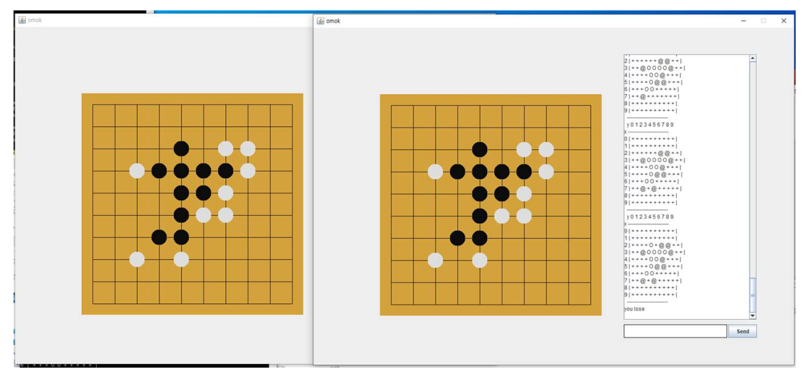

# Online-Omok-Client
자바로 구현한 온라인 오목 게임 클라이언트 A Online Omok Client implemented by JAVA

서버가 우선 두 클라이언트를 매칭해 준 뒤, 두 클라이언트는 서로의 ip, port를 서버로 부터 전달 받아
UDP로 오목 게임을 진행합니다.
After the server first matches the two clients, the two clients receive each other's ip and port from the server
Play the concave game with UDP.

